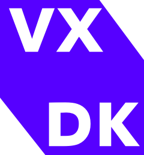

# 

# VXDK - Video Experience Development Kit

VXDK provides the essential tools to create engaging, interactive video experiences. Utilize our toolkit to integrate interactive features directly into your video content.

## Key Features

- **Robust Video Player**: Modern design, extensible with a dynamically loaded plugin system.
- **Easy to Use API**: Beautifully simple, making configuration straightforward.
- **Flexible UI Customization**: Extend the user interface with Solid.js components.
- **Comprehensive Event Handling**: Standardized event system ensures consistency across all player adapters.
- **Full Feature Set**: Includes responsive design, picture-in-picture, keyboard shortcuts, HLS & DASH support, monetization tools (Google IMA & Vast), and fullscreen mode.

## Design Philosophy

- **Pluggable UI**: Built on SolidJS, allowing for seamless integration of custom UI components.
- **Modular Architecture**: Core functionality is encapsulated in a thin layer, supporting extensive customization through plugins.
- **Multi-platform Compatibility**: Designed for native playback across multiple platforms with ongoing development for additional platform support.

## Comparisons

VXDK draws inspiration from established players like videojs, clappr, plyr.io, and indigo player, enhancing their ideas with our innovative approach.

For full documentation and more details, visit our [website](https://vxdk.dev).
